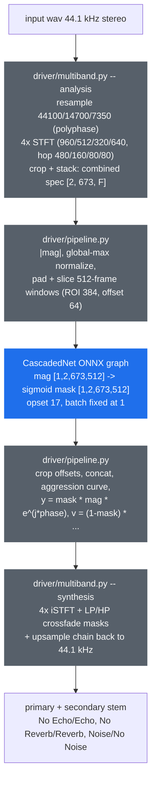

# port-uvr-deecho-onnx

**ONNX/DirectML port of UVR's VR-architecture De-Echo / De-Reverb / De-Noise models (by FoxJoy) — echo, reverb and noise removal on *any* DX12 GPU (AMD, Intel, NVIDIA), no CUDA, no torch at inference time.**

[](LICENSE)
[](artifacts/manifest.json)
[](https://onnxruntime.ai/docs/execution-providers/DirectML-ExecutionProvider.html)
[](toolkit/setup-env.ps1)

## Why this exists

[Ultimate Vocal Remover](https://github.com/Anjok07/ultimatevocalremovergui)'s De-Echo,
De-Reverb and De-Noise models (trained by FoxJoy on the VR 5.1 CascadedNet architecture) are
the standard open tools for stripping echo, reverb and background noise from a recording. Like
most of the UVR ecosystem, they ship as PyTorch `.pth` checkpoints: running them means carrying
a full torch install, and GPU acceleration means CUDA.

**This project exports the four FoxJoy models to plain ONNX graphs** and reimplements the
entire multiband pre/post-processing chain in pure **numpy + scipy** — so inference runs
through [onnxruntime](https://onnxruntime.ai/) on any execution provider (DirectML on any DX12
GPU, CUDA, CPU) with zero torch, zero librosa at runtime.

The golden reference for every parity number below is
[python-audio-separator](https://github.com/nomadkaraoke/python-audio-separator) (MIT), whose
`uvr_lib_v5/vr_network` is the canonical VR implementation.

## Models

| Model | Primary stem (`mask * spec`) | Secondary stem (`(1 - mask) * spec`) | UVR hash (md5, last 10 MB) | nout | UVR `primary_stem` |
|---|---|---|---|---|---|
| UVR-De-Echo-Normal | No Echo | Echo | `f200a145434efc7dcf0cd093f517ed52` | 48 | `No Other` |
| UVR-De-Echo-Aggressive | No Echo | Echo | `6857b2972e1754913aad0c9a1678c753` | 48 | `No Other` |
| UVR-DeEcho-DeReverb | No Reverb | Reverb | `0fb9249ffe4ffc38d7b16243f394c0ff` | 64 | `No Other` |
| UVR-DeNoise | **Noise** | **No Noise** | `44c55d8b5d2e3edea98c2b2bf93071c7` | 48 | `Other` |

All four are VR 5.1 `CascadedNet` (4band_v3 params, `n_fft=1344`, `nout_lstm=128`), trained by
FoxJoy, and share one graph shape.

**Watch the polarity — De-Noise is inverted.** The De-Echo/De-Reverb models predict the **dry**
signal, so `mask * spec` is what you keep. De-Noise's mask targets the **noise**, so the cleaned
audio is the *secondary* stem, `(1 - mask) * spec`. This is not a naming quirk: UVR's
`vr_model_data` gives De-Noise `primary_stem = "Other"` (vs `"No Other"` for the De-Echo family),
and `"Other"` is in the reference's `NON_ACCOM_STEMS`, which **also flips the aggression exponent
to `1 - aggr`**. Both consequences are wired to one flag:

```python
DeEchoDriver(run_graph, is_non_accom_stem=MODEL_SPECS[name]["is_non_accom_stem"])
```

Get that flag wrong and you still get plausible-looking audio with a silently wrong mask, so
`tests/test_aggression.py` pins the formula against `spec_utils.adjust_aggr` and pins every
model's flag against the reference's own `NON_ACCOM_STEMS` tuple.

### Not ported (and why)

The VR download list has 27 checkpoints; these are the ones deliberately left out after review:

| Model | Reason |
|---|---|
| `UVR-DeNoise-Lite` | **Different band config.** Its `vr_model_data` entry is `1band_sr44100_hl1024` (single band, `n_fft=2048`, hop 1024, 1024 bins, `nout=16`), not `4band_v3` — `driver/multiband.py` is specialised to the 4-band chain, so it would need a second analysis/synthesis path *and* a second graph I/O shape. Not worth it: it is the reduced-quality sibling of `UVR-DeNoise`, which ports cleanly and covers the same job. |
| `UVR-BVE-4B_SN-44100-1` | Backing-vocal extraction, not cleanup — out of scope. Also absent from `vr_model_data`, so the reference falls back to defaults for it. |
| `17_HP-Wind_Inst-UVR` | Removes wind instruments (`4band_v3`, `No Woodwinds`). Technically portable with this driver, but it is stem separation, not cleanup. |
| `1_HP`…`16_SP`, `MGM_*` v4 | Vocal/instrumental separation — a different job, already better served by the MDX-Net line. |

Model weights are by **FoxJoy**, distributed via the official UVR Download Center
([TRvlvr/model_repo](https://github.com/TRvlvr/model_repo/releases/tag/all_public_uvr_models),
release `all_public_uvr_models`); UVR is MIT-licensed. The exported `.onnx` graphs are
published in this repo's [`models-v1.1`](https://github.com/santiquiroz/port-uvr-deecho-onnx/releases/tag/models-v1.1) release together with
`manifest.json` (source-checkpoint UVR hashes + SHA-256 of every `.onnx`).

## How it works

The network itself is only the middle of the UVR VR pipeline. Everything around it — the
4-band multiband STFT, window slicing, mask post-processing, multiband iSTFT with crossover
filters — lives **outside** the graph, and this repo reimplements all of it torch-free:



**Analysis** (`driver/multiband.py`, mirroring `VRSeparator.loading_mix`): the 44.1 kHz
input is resampled down a chain (44100 → 14700 → 7350 Hz, scipy polyphase — identical to
the reference's `res_type="polyphase"`), each band gets its own STFT
(`n_fft`/hop: 960/480, 512/160, 320/80, 640/80), and per-band bin crops are stacked into
one combined 673-bin spectrogram at ~10.9 ms hop resolution.

**Network**: magnitude only. Global-max normalize, pad, slice into 512-frame windows that
overlap by 128 frames; each window is one ONNX call (batch fixed at 1 — the BiLSTM breaks
export at batch > 1, and the reference runs batch 1 anyway). The graph returns the full
512-frame sigmoid mask; the driver crops the 64-frame edges (ROI 384) and concatenates.

**Synthesis** (`driver/multiband.py`, mirroring `spec_utils.cmb_spectrogram_to_wave`): the
aggression curve (`mask^(1+aggr)`, default aggression 5) is applied, the mask picks
dry/wet complex specs, and each band is re-expanded, LP/HP crossfade-masked, iSTFT'd and
summed while upsampling back up the chain to 44.1 kHz.

**The one deliberate divergence from the reference**: the reference upsamples the
synthesis chain with libsamplerate (`sinc_fastest` on Windows); this driver uses the same
scipy polyphase kernel it uses for analysis (integer ratios: 2x, 3x). Everything else in
the chain is numerically interchangeable with librosa/audio-separator — measured, not
assumed (see the parity table).

## Usage

### Toolkit setup

```powershell
pwsh -File toolkit/setup-env.ps1     # .venv: py3.11, torch CPU, audio-separator, ort-directml
```

Re-exporting or re-validating needs the 4 source `.pth` checkpoints in `models/`
(gitignored) — grab them from the [UVR Download Center release](https://github.com/TRvlvr/model_repo/releases/tag/all_public_uvr_models).
Just *running* the published graphs needs none of that: only `driver/` + the
[`models-v1.1`](https://github.com/santiquiroz/port-uvr-deecho-onnx/releases/tag/models-v1.1) release assets + numpy/scipy/onnxruntime.

```powershell
# Regenerate the synthetic fixture + golden reference dumps (audio-separator code path)
.venv/Scripts/python.exe toolkit/make_fixture.py
.venv/Scripts/python.exe toolkit/capture_baseline.py

# Export ONNX graphs (all 4, or a subset by name)
.venv/Scripts/python.exe toolkit/export_deecho.py

# Parity gates vs the golden dumps, CPU-EP and DirectML
.venv/Scripts/python.exe toolkit/validate_ort.py

# Throughput bench, CPU-EP vs DirectML
.venv/Scripts/python.exe toolkit/bench_dml.py
```

### Using the driver standalone

`driver/` imports nothing from `toolkit/` — vendor it into any Python project together
with a `models-v1.1` release graph:

```python
import onnxruntime as ort
import soundfile as sf

from driver.pipeline import DeEchoDriver

sess = ort.InferenceSession(
    "UVR-DeEcho-DeReverb.onnx",
    providers=[("DmlExecutionProvider", {"device_id": 0}), "CPUExecutionProvider"],
)
driver = DeEchoDriver(lambda window: sess.run(None, {"mag": window})[0])  # aggression=5

mix, sr = sf.read("input.wav", dtype="float32")   # 44.1 kHz; driver expects [2, N]
dry, wet = driver.separate(mix.T)                 # "No Reverb" stem, "Reverb" stem
sf.write("no_reverb.wav", dry.T, sr)
sf.write("reverb.wav", wet.T, sr)
```

Input must be 44.1 kHz (resample first if not — the reference pipeline is defined at
44.1 kHz). Mono arrays are auto-duplicated to stereo.

For **UVR-DeNoise** the call changes in two ways — pass the flag, and keep the *other* stem:

```python
from driver.pipeline import MODEL_SPECS, DeEchoDriver

spec = MODEL_SPECS["UVR-DeNoise"]
driver = DeEchoDriver(
    lambda window: sess.run(None, {"mag": window})[0],
    is_non_accom_stem=spec["is_non_accom_stem"],   # True -> aggression exponent 1-aggr
)
noise, clean = driver.separate(mix.T)              # primary = "Noise", secondary = "No Noise"
```

`separate()` always returns `(primary, secondary)`; `MODEL_SPECS[name]["primary_stem"]` /
`["secondary_stem"]` say which is which, and the same fields are in the release
`manifest.json` so a consumer that only downloads the graphs still gets the polarity.

## Status

**Models**: published as GitHub release [`models-v1.1`](https://github.com/santiquiroz/port-uvr-deecho-onnx/releases/tag/models-v1.1) — 4 fp32 `.onnx` graphs + `manifest.json` (source `.pth` UVR hashes, SHA-256 of each graph, measured parity).

All numbers below are measured on real hardware (Ryzen + RX 7800 XT, DirectML), against
golden dumps produced by audio-separator 0.44.5's own code path on the committed synthetic
fixture (`toolkit/capture_baseline.py` — 10 s stereo 44.1 kHz with baked-in delay echo +
noise-reverb tail). Regenerate everything yourself: `make_fixture.py` → `capture_baseline.py`
→ `validate_ort.py`.

### Parity (toolkit/validate_ort.py — all gates OK, CPU-EP and DirectML)

Gates: mask p99.9 < 1e-4 AND mask RMS < 1e-5; stems SI-SDR > 40 dB. max-abs is printed
but informational — see "honest numbers" below.

| Model | EP | mask p99.9 | mask RMS | mask max-abs (info) | stems SI-SDR dry/wet | synth-only floor |
|---|---|---|---|---|---|---|
| De-Echo-Normal | CPU | 8.9e-06 | 1.1e-06 | 1.1e-04 | 62.5 / 62.6 dB | 62.5 dB |
| De-Echo-Normal | DML | 1.2e-05 | 1.5e-06 | 1.5e-04 | 62.5 / 62.6 dB | 62.5 dB |
| De-Echo-Aggressive | CPU | 1.8e-05 | 1.7e-06 | 7.7e-05 | 63.5 / 61.7 dB | 63.5 dB |
| De-Echo-Aggressive | DML | 1.5e-05 | 1.6e-06 | 1.2e-04 | 63.5 / 61.7 dB | 63.5 dB |
| DeEcho-DeReverb | CPU | 2.6e-05 | 2.3e-06 | 1.2e-04 | 61.1 / 65.1 dB | 61.1 dB |
| DeEcho-DeReverb | DML | 3.7e-05 | 3.9e-06 | 4.1e-04 | 61.1 / 65.1 dB | 61.1 dB |
| DeNoise | CPU | 6.7e-06 | 8.5e-07 | 4.0e-05 | 63.0 / 62.5 dB | 63.0 dB |
| DeNoise | DML | 6.5e-06 | 8.7e-07 | 5.4e-05 | 63.0 / 62.5 dB | 63.0 dB |

De-Noise is the cleanest of the four and the only one whose mask max-abs stays under 1e-4 on
*both* providers — its mask is near-zero over most of the spectrogram (it isolates noise), so
there is far less sigmoid mid-slope for float32 reassociation to bite.

Supporting numbers:

- **Pre-chain** (driver's numpy STFT + polyphase resample chain vs librosa's): combined-spec
  max-abs **3.9e-06** — the analysis side is numerically interchangeable. Unit-level:
  STFT ≤ 1.4e-06, iSTFT ≤ 3.0e-07, downsample chain exactly 0.0 (same scipy kernel).
- **Net-level export parity** (torch vs ONNX CPU-EP, random windows,
  `toolkit/export_deecho.py`): 3.1e-05 / 6.2e-05 / 1.1e-04 / 6.3e-06
  (Normal / Aggressive / DeReverb / DeNoise).
- **The export is reproducible**: re-running `export_deecho.py` on the pinned toolkit env
  regenerates all four graphs **byte-identical** (same SHA-256 as the release assets), so the
  manifest hashes are verifiable from source rather than trust-me values.

**Honest numbers, two caveats:**

1. **mask max-abs lands at 7.7e-05–4.1e-04, above a naive 1e-4 reading on 5 of 6 rows.** It is
   outlier-dominated: a handful of sigmoid mid-slope elements absorb the float32
   reassociation of the graph (verified by feeding the *golden* spectrogram into the ONNX
   mask path — same max/RMS/p99.9, so it is not driver pre-chain drift). 99.9% of mask
   elements sit under 3.7e-05 and RMS under 4e-06 on every model/provider, and the stems
   SI-SDR is *identical* to the synth-only floor — those outliers contribute nothing
   measurable to the audio. That is why the gate is p99.9+RMS with max-abs printed, not a
   max-abs gate.
2. **Stems SI-SDR is 61–65 dB, and that floor is not the mask's fault.** Feeding the
   golden `y_spec`/`v_spec` through this driver's synthesis chain alone reproduces the same
   SI-SDR (synth-only column) — the entire divergence is the documented resampler swap
   (scipy polyphase here vs libsamplerate `sinc_fastest` in the reference's upsample chain).
   61–65 dB means the error signal sits >60 dB below the stem: far beyond audibility, but
   it is the real, measured ceiling of this port against audio-separator-on-Windows, so it
   is reported instead of hidden behind a vague "matches the reference".

### Throughput (toolkit/bench_dml.py — RX 7800 XT, DirectML vs CPU-EP)

One "window" = one network call (`mag [1,2,673,512]`), which advances 384 ROI frames ×
480-sample hop = **4.18 s of audio**. e2e = `DeEchoDriver.separate()` on the 10 s fixture,
including the whole numpy pre/post chain (3 network calls). 12 timed runs after 3 warmups.

| Model | EP | ms/window | window realtime | e2e (10 s fixture) | DML speedup (window) |
|---|---|---|---|---|---|
| De-Echo-Normal | CPU | 624.6 | 6.7x | 2.27 s (4.4x) | — |
| De-Echo-Normal | DML | 32.1 | 130.2x | 0.48 s (20.7x) | **19.5x** |
| De-Echo-Aggressive | CPU | 616.2 | 6.8x | 2.24 s (4.5x) | — |
| De-Echo-Aggressive | DML | 32.4 | 129.1x | 0.47 s (21.3x) | **19.0x** |
| DeEcho-DeReverb | CPU | 958.7 | 4.4x | 3.17 s (3.2x) | — |
| DeEcho-DeReverb | DML | 43.2 | 96.8x | 0.51 s (19.7x) | **22.2x** |
| DeNoise † | CPU | 616.9 | 6.8x | 2.45 s (4.1x) | — |
| DeNoise † | DML | 32.6 | 128.4x | 0.50 s (19.9x) | **18.9x** |

† The De-Noise row was measured later, on a box that was busy with unrelated jobs, so
mean-of-12 was inflated and unstable (±2x run to run). It is reported as **min of 25 runs**
instead — the standard contention-robust estimator. That substitution is validated, not
assumed: re-measuring the other three models the same way reproduced their committed
mean-of-12 numbers within 3% (624.1 vs 624.6 / 623.4 vs 616.2 / 930.7 vs 958.7 ms CPU;
32.6 vs 32.1 / 32.4 vs 32.4 / 42.8 vs 43.2 ms DML), so the rows are comparable. The result
is also what the architecture predicts: De-Noise is the same graph shape as De-Echo-Normal
(`nn_arch_size=123821`, `nout=48`, byte-identical graph size), and it lands on that row.

On DirectML the network stops being the bottleneck: ~65–75% of e2e wall time is the numpy
pre/post chain (STFT/iSTFT/resample), which is why e2e realtime (~20x) sits far below the
per-window realtime (~100–130x). For long files the pre/post cost scales linearly and the
gap stays roughly constant; nothing in the driver is O(n²).

## Integration notes (Upflow)

This port follows the same pattern as
[port-gmfss-onnx](https://github.com/santiquiroz/port-gmfss-onnx) and
[port-audiosr-onnx](https://github.com/santiquiroz/port-audiosr-onnx): `driver/` is
self-contained (numpy + scipy + an onnxruntime session the caller owns) and designed to be
vendored as-is. A caller integrating it needs to: resample input to 44.1 kHz, hand
`DeEchoDriver.separate()` a `[2, N]` float32 array, and write out whichever stem it wants
— plus its own session cache / chunking / cancellation policy, which are deliberately out
of scope here.

## Credits & license

- **Code in this repo**: MIT (see [LICENSE](LICENSE)).
- **Model weights**: trained by **FoxJoy**, distributed via the official
  [UVR](https://github.com/Anjok07/ultimatevocalremovergui) Download Center
  ([TRvlvr/model_repo](https://github.com/TRvlvr/model_repo/releases/tag/all_public_uvr_models)).
  UVR is MIT-licensed. The ONNX graphs in the release are a mechanical format conversion of
  those weights; all credit for the models belongs to FoxJoy / the UVR project.
- **Golden reference & vendored architecture**:
  [python-audio-separator](https://github.com/nomadkaraoke/python-audio-separator) (MIT) —
  `toolkit/vr_cascaded_net.py` is adapted from its `uvr_lib_v5/vr_network` (one
  export-neutral pooling change, documented in the file header), and every parity number
  above is measured against its output.
