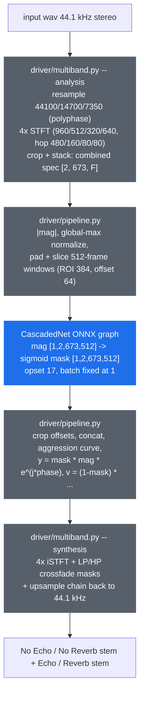

# port-uvr-deecho-onnx

**ONNX/DirectML port of UVR's VR-architecture De-Echo / De-Reverb models (by FoxJoy) — echo and reverb removal on *any* DX12 GPU (AMD, Intel, NVIDIA), no CUDA, no torch at inference time.**

[](LICENSE)
[](artifacts/manifest.json)
[](https://onnxruntime.ai/docs/execution-providers/DirectML-ExecutionProvider.html)
[](toolkit/setup-env.ps1)

## Why this exists

[Ultimate Vocal Remover](https://github.com/Anjok07/ultimatevocalremovergui)'s De-Echo and
De-Reverb models (trained by FoxJoy on the VR 5.1 CascadedNet architecture) are the standard
open tools for stripping echo and reverb from a recording. Like most of the UVR ecosystem,
they ship as PyTorch `.pth` checkpoints: running them means carrying a full torch install, and
GPU acceleration means CUDA.

**This project exports the three FoxJoy models to plain ONNX graphs** and reimplements the
entire multiband pre/post-processing chain in pure **numpy + scipy** — so inference runs
through [onnxruntime](https://onnxruntime.ai/) on any execution provider (DirectML on any DX12
GPU, CUDA, CPU) with zero torch, zero librosa at runtime.

The golden reference for every parity number below is
[python-audio-separator](https://github.com/nomadkaraoke/python-audio-separator) (MIT), whose
`uvr_lib_v5/vr_network` is the canonical VR implementation.

## Models

| Model | Primary stem | UVR hash (md5, last 10 MB) | nout | Source |
|---|---|---|---|---|
| UVR-De-Echo-Normal | No Echo | `f200a145434efc7dcf0cd093f517ed52` | 48 | FoxJoy |
| UVR-De-Echo-Aggressive | No Echo | `6857b2972e1754913aad0c9a1678c753` | 48 | FoxJoy |
| UVR-DeEcho-DeReverb | No Reverb | `0fb9249ffe4ffc38d7b16243f394c0ff` | 64 | FoxJoy |

All three are VR 5.1 `CascadedNet` (4band_v3 params, `n_fft=1344`, `nout_lstm=128`) and
predict the **dry** signal via a sigmoid mask; the wet stem (Echo / Reverb) is `1 - mask`.

Model weights are by **FoxJoy**, distributed via the official UVR Download Center
([TRvlvr/model_repo](https://github.com/TRvlvr/model_repo/releases/tag/all_public_uvr_models),
release `all_public_uvr_models`); UVR is MIT-licensed. The exported `.onnx` graphs are
published in this repo's [`models-v1.0`](https://github.com/santiquiroz/port-uvr-deecho-onnx/releases/tag/models-v1.0) release together with
`manifest.json` (source-checkpoint UVR hashes + SHA-256 of every `.onnx`).

## How it works

The network itself is only the middle of the UVR VR pipeline. Everything around it — the
4-band multiband STFT, window slicing, mask post-processing, multiband iSTFT with crossover
filters — lives **outside** the graph, and this repo reimplements all of it torch-free:



**Analysis** (`driver/multiband.py`, mirroring `VRSeparator.loading_mix`): the 44.1 kHz
input is resampled down a chain (44100 → 14700 → 7350 Hz, scipy polyphase — identical to
the reference's `res_type="polyphase"`), each band gets its own STFT
(`n_fft`/hop: 960/480, 512/160, 320/80, 640/80), and per-band bin crops are stacked into
one combined 673-bin spectrogram at ~10.9 ms hop resolution.

**Network**: magnitude only. Global-max normalize, pad, slice into 512-frame windows that
overlap by 128 frames; each window is one ONNX call (batch fixed at 1 — the BiLSTM breaks
export at batch > 1, and the reference runs batch 1 anyway). The graph returns the full
512-frame sigmoid mask; the driver crops the 64-frame edges (ROI 384) and concatenates.

**Synthesis** (`driver/multiband.py`, mirroring `spec_utils.cmb_spectrogram_to_wave`): the
aggression curve (`mask^(1+aggr)`, default aggression 5) is applied, the mask picks
dry/wet complex specs, and each band is re-expanded, LP/HP crossfade-masked, iSTFT'd and
summed while upsampling back up the chain to 44.1 kHz.

**The one deliberate divergence from the reference**: the reference upsamples the
synthesis chain with libsamplerate (`sinc_fastest` on Windows); this driver uses the same
scipy polyphase kernel it uses for analysis (integer ratios: 2x, 3x). Everything else in
the chain is numerically interchangeable with librosa/audio-separator — measured, not
assumed (see the parity table).

## Usage

### Toolkit setup

```powershell
pwsh -File toolkit/setup-env.ps1     # .venv: py3.11, torch CPU, audio-separator, ort-directml
```

Re-exporting or re-validating needs the 3 source `.pth` checkpoints in `models/`
(gitignored) — grab them from the [UVR Download Center release](https://github.com/TRvlvr/model_repo/releases/tag/all_public_uvr_models).
Just *running* the published graphs needs none of that: only `driver/` + the
[`models-v1.0`](https://github.com/santiquiroz/port-uvr-deecho-onnx/releases/tag/models-v1.0) release assets + numpy/scipy/onnxruntime.

```powershell
# Regenerate the synthetic fixture + golden reference dumps (audio-separator code path)
.venv/Scripts/python.exe toolkit/make_fixture.py
.venv/Scripts/python.exe toolkit/capture_baseline.py

# Export ONNX graphs (all 3, or a subset by name)
.venv/Scripts/python.exe toolkit/export_deecho.py

# Parity gates vs the golden dumps, CPU-EP and DirectML
.venv/Scripts/python.exe toolkit/validate_ort.py

# Throughput bench, CPU-EP vs DirectML
.venv/Scripts/python.exe toolkit/bench_dml.py
```

### Using the driver standalone

`driver/` imports nothing from `toolkit/` — vendor it into any Python project together
with a `models-v1.0` release graph:

```python
import numpy as np
import onnxruntime as ort
import soundfile as sf

from driver.pipeline import DeEchoDriver

sess = ort.InferenceSession(
    "UVR-DeEcho-DeReverb.onnx",
    providers=[("DmlExecutionProvider", {"device_id": 0}), "CPUExecutionProvider"],
)
driver = DeEchoDriver(lambda window: sess.run(None, {"mag": window})[0])  # aggression=5

mix, sr = sf.read("input.wav", dtype="float32")   # 44.1 kHz; driver expects [2, N]
dry, wet = driver.separate(mix.T)                 # "No Reverb" stem, "Reverb" stem
sf.write("no_reverb.wav", dry.T, sr)
sf.write("reverb.wav", wet.T, sr)
```

Input must be 44.1 kHz (resample first if not — the reference pipeline is defined at
44.1 kHz). Mono arrays are auto-duplicated to stereo.

## Status

